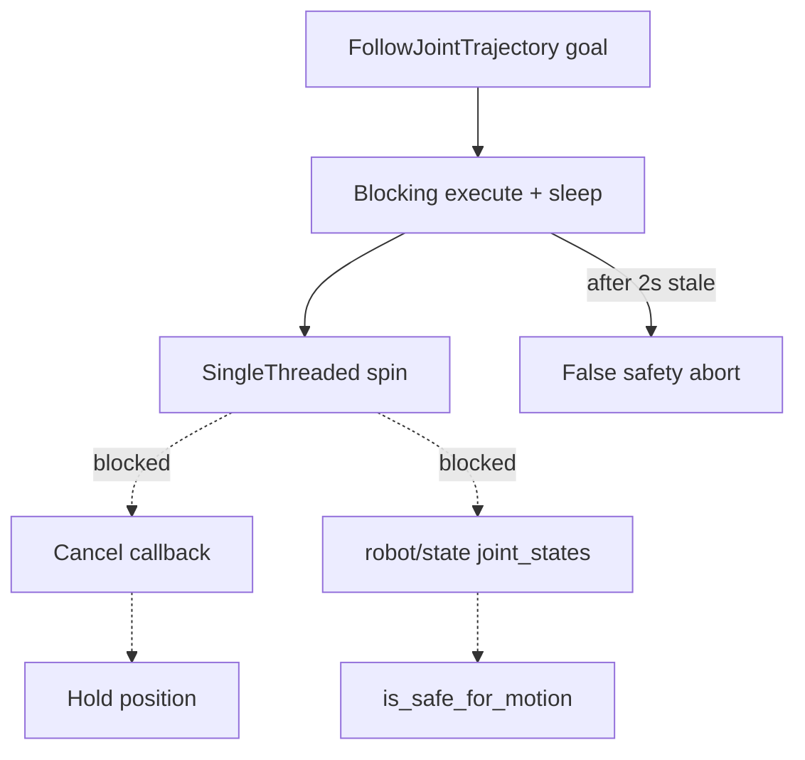

# Codebase audit and remediation plan

## Audit verdict

Sim Gazebo/MoveIt paths are largely coherent. The serious defects sit in **committed hardware prep** ([`baxter_hardware_bridge`](src/baxter_hardware_bridge/), [`scripts/py_bridge.py`](scripts/py_bridge.py)): production safety/cancel can go deaf mid-motion, and dry-run hides that. Docs also disagree with themselves on domain isolation and what “blocked I10” means after I10-prep landed.

Working tree already has related WIP (`py_bridge` Slave API rewrite, `moveit_pose` plan-only tweak, loopback script). Remediation should build on that WIP, not discard it.

---

## Priority 1 — P0 hardware shim executor (must fix)

**Bug:** [`follow_joint_trajectory_shim.py`](src/baxter_hardware_bridge/baxter_hardware_bridge/follow_joint_trajectory_shim.py) `main()` uses `rclpy.spin()` while `_execute_callback` blocks on `time.sleep`. Cancel, `/robot/state`, and joint-state updates do not run during a goal. After `STATE_TIMEOUT_SEC` (2s) the goal can abort as “stale” even when the robot is fine; within 2s e-stop is invisible. [`dry_run_test.py`](src/baxter_hardware_bridge/baxter_hardware_bridge/dry_run_test.py) uses `MultiThreadedExecutor` and masks this.

**Fix:**
- Switch production `main()` to `MultiThreadedExecutor` (shared helper with dry-run so they cannot diverge).
- On unsafe abort: **stop publishing** holds (do not command through e-stop).
- Track `_last_commanded` on every publish; cancel/hold uses that, not stale waypoint state.
- Reject goals where any point’s `positions` length ≠ joint count (`INVALID_GOAL`).
- Cancel result: do not set `error_code = SUCCESSFUL` (use a non-success / canceled semantic consistent with this stack’s checks).
- Extend dry-run (or a small unit test) so mid-goal cancel and unsafe-state abort are exercised under the **same** executor as `main()`.

---

## Priority 2 — P1 `py_bridge` correctness

Build on the uncommitted Slave API work in [`scripts/py_bridge.py`](scripts/py_bridge.py):

| Issue | Fix |
|---|---|
| ROS 2 publish from TCPROS daemon threads | Queue msgs; publish from a timer / main-thread callback |
| `--ip` autodetection ignores `--master` host; silent fallback `192.168.1.108` | Probe host from `--master`; fail loudly if detection fails |
| `sendall` under lock, no timeout | Socket timeouts; send outside lock / drop slow peers |
| Incomplete unregister / no-op `publisherUpdate` | Pass `caller_api`; reconnect on publisher list changes |
| Silent deser failures / unbounded frame sizes | Rate-limited log; cap header/body length |

Keep [`scripts/test_bridge_loopback.sh`](scripts/test_bridge_loopback.sh) CWD-safe (resolve repo root from script path). Align [`docs/hardware_runbook.md`](docs/hardware_runbook.md) pre-lab section with the script once committed.

---

## Priority 3 — Sim / MoveIt P2 polish

- [`sim.launch.py`](src/baxter_gz_sim/launch/sim.launch.py): gate controller spawners on spawn `returncode == 0` (same pattern as MoveIt readiness shutdown).
- [`wait_for_sim_ready.py`](src/baxter_moveit_config/scripts/wait_for_sim_ready.py): timeout message must name missing joints **and** missing action servers.
- [`moveit_pose.py`](src/baxter_examples/baxter_examples/moveit_pose.py): cancel in-flight goal on interrupt (mirror `moveit_left_tiny`); finish the in-progress plan-only/path fix cleanly.
- [`.github/workflows/ci.yml`](.github/workflows/ci.yml): compile/import `baxter_hardware_bridge`; run `ros2 run baxter_hardware_bridge dry_run_test` (still hardware-free).

Out of this pass (document only, do not rewire now): orphaned [`moveit_controllers_hardware.yaml`](src/baxter_moveit_config/config/moveit_controllers_hardware.yaml) until a real hardware MoveIt launch exists; bringup `joint_state_publisher` for description-only RViz (optional UX).

---

## Priority 4 — Documentation consistency

Chosen policy (matches README/CHANGELOG Unreleased): **one simulation at a time; no domain/partition isolation in the documented workflow.**

Align:
- [`CONTRIBUTING.md`](CONTRIBUTING.md), [`docs/getting_started_sim.md`](docs/getting_started_sim.md), [`docs/ci_release_checklist.md`](docs/ci_release_checklist.md) (drop “unused pair” wording).
- [`AGENTS.md`](AGENTS.md) resume text: no open unblocked step (I10–I12 blocked; I13 deferred) — stop claiming **I01**.
- Hardware inventory: [`docs/package_map.md`](docs/package_map.md), [`README.md`](README.md), [`docs/index.md`](docs/index.md) — describe `baxter_hardware_bridge` + runbook as **prep-only / unsupported until I10 gate**, not “does not exist” and not “do not add” after it was merged.
- Profile naming: prefer `supervised hardware motion` everywhere (fix `hardware_motion` in compatibility matrix).
- Note in runbook that `dry_run_test` alone is not proof of production safety until Priority 1 lands.

Do **not** rewrite completed `logs/` or past `PROMPTS.md` entries; if a correction note is needed, append to a new audit log only if you want baton evidence (optional; this is not a MASTER_PLAN step).

---

## Verification

1. `ros2 run baxter_hardware_bridge dry_run_test` → PASS, including cancel + unsafe mid-goal cases.
2. CI-equivalent: compileall/import including hardware package; existing MoveIt static checks still pass.
3. Manual (if Gazebo available): failed spawn does not start controllers; MoveIt interrupt cancels cleanly.
4. Loopback script from non-root cwd still works (or documents `cd` requirement if lab-only).
5. Grep docs: no remaining “require ROS_DOMAIN_ID/GZ_PARTITION for sim smoke” vs “isolation dropped” conflict.

---

## Explicitly not in scope

- Unblocking I10–I12 or real-robot motion.
- Gripper command support / DART mimic (deferred I13).
- Full Gazebo+MoveIt in default CI.
- Style-only refactors or large MoveIt hardware launch scaffolding.
