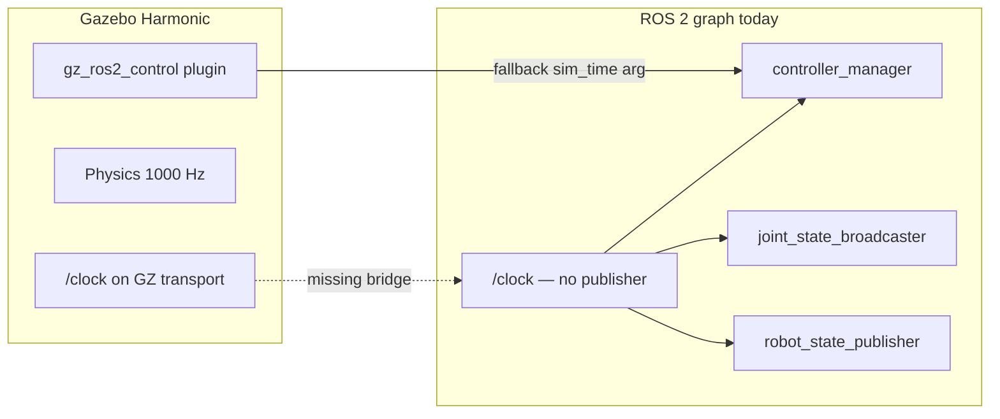

# Sim Clock Diagnosis and Fix Plan

## What your terminals show

### Working (I05 gate satisfied)

From [terminals/3.txt](file:///home/yunusdanabas/.cursor/projects/home-yunusdanabas-baxter-ros2-jazzy/terminals/3.txt):

- `ros2 control list_controllers` — all three controllers **active**
- `/joint_states` — all **14 arm joints** present with plausible positions/velocities

From [terminals/2.txt](file:///home/yunusdanabas/.cursor/projects/home-yunusdanabas-baxter-ros2-jazzy/terminals/2.txt):

- Gazebo spawns Baxter, `gz_ros2_control` loads all 14 joints, hardware initializes, spawners succeed

### The real problem: missing ROS 2 sim clock

| Symptom | Your log | Meaning |
|---------|----------|---------|
| Repeated warning | `No clock received, using time argument instead!` | `controller_manager` has `use_sim_time=true` but no `/clock` publisher on the ROS graph |
| Zero timestamps | `/joint_states` `header.stamp: sec: 0, nanosec: 0` | `joint_state_broadcaster` stamps from ROS clock, which stays at epoch 0 without `/clock` |
| Controllers still work | Positions/velocities valid | `gz_ros2_control` passes sim time directly into its update loop as a fallback |



**Root cause (confirmed by Copilot + repo inspection):** [`sim.launch.py`](src/baxter_gz_sim/launch/sim.launch.py) launches Gazebo and spawns the robot but has **no `ros_gz_bridge` clock bridge** and **no `use_sim_time` on external nodes**:

```39:45:src/baxter_gz_sim/launch/sim.launch.py
    robot_state_publisher = Node(
        package="robot_state_publisher",
        executable="robot_state_publisher",
        name="robot_state_publisher",
        output="screen",
        parameters=[{"robot_description": robot_description}],
    )
```

This was already flagged as a known non-blocker in [`logs/I05_ros2_control_arm_controllers.log.md`](logs/I05_ros2_control_arm_controllers.log.md) (line 96): *"If later trajectory timing is flaky, I06 should decide whether a `/clock` bridge or launch timing tweak is needed."*

The fix pattern is documented in [`RESEARCH_FINDINGS.md`](RESEARCH_FINDINGS.md) (lines 299–337) but was never wired into the launch file.

### Secondary warnings (not blockers)

1. **Gripper mimic constraint** — `l_gripper_r_finger_joint`: DART physics in Harmonic does not support URDF mimic joints. Known since I04; grippers are out of scope until a later step.

2. **Controller update period** — `0.01 s` (100 Hz from [`ros2_controllers.yaml`](src/baxter_gz_sim/config/ros2_controllers.yaml)) vs Gazebo `0.001 s` (1000 Hz physics). Informational only; unrelated to the clock issue. No change needed unless you want to silence the log.

3. **NaN effort on `/joint_states`** — Expected: position interfaces only; no effort state interfaces configured.

## Recommended fix (do before or as part of I06)

I06 (`sim_tiny_trajectory`) sends `FollowJointTrajectory` goals — those **require valid sim timestamps**. Fix the clock bridge first.

### 1. Add unidirectional clock bridge to launch

In [`src/baxter_gz_sim/launch/sim.launch.py`](src/baxter_gz_sim/launch/sim.launch.py), add alongside `gazebo`:

```python
clock_bridge = Node(
    package='ros_gz_bridge',
    executable='parameter_bridge',
    arguments=['/clock@rosgraph_msgs/msg/Clock[gz.msgs.Clock'],
    output='screen',
)
```

- Direction `[` = GZ → ROS only (matches [RESEARCH_FINDINGS.md](RESEARCH_FINDINGS.md) guidance: never bidirectional on `/clock`)
- Reference: `/opt/ros/jazzy/share/ros_gz_sim_demos/launch/joint_states.launch.py`

### 2. Set `use_sim_time: true` on external ROS nodes

At minimum, add to `robot_state_publisher`:

```python
parameters=[
    {'robot_description': robot_description},
    {'use_sim_time': True},
],
```

Also apply to I06 trajectory client nodes and any future RViz/MoveIt nodes.

### 3. Add package dependency

In [`src/baxter_gz_sim/package.xml`](src/baxter_gz_sim/package.xml), add:

```xml
<exec_depend>ros_gz_bridge</exec_depend>
```

(`ros_gz_bridge` is typically installed with the Gazebo ROS stack; verify with `ros2 pkg prefix ros_gz_bridge`.)

### 4. Verification commands (post-fix)

With sim running:

```bash
ros2 topic info /clock                    # Publisher count: 1
ros2 topic echo /clock --once             # sec/nanosec advancing
ros2 topic echo /joint_states --once      # header.stamp non-zero
ros2 launch baxter_gz_sim sim.launch.py   # no repeating "No clock received" spam
```

## Scope note (Baton workflow)

- I05 remains **completed** — its gate did not require `/clock`.
- Clock bridge is **prerequisite for I06**, not a separate master-plan step. Implement it as the first change when executing I06, then proceed with `baxter_examples/sim_tiny_trajectory`.
- Do not change `update_rate` or physics step unless you explicitly want to silence the informational period warning.

## Copilot verification summary

Copilot ([research agent](6e2174fc-9859-4353-90ab-cc92c011a664)) cross-checked against:

- [gz_ros2_control #439](https://github.com/ros-controls/gz_ros2_control/issues/439) — clock fallback behavior
- [Gazebo Harmonic ROS 2 launch docs](https://gazebosim.org/docs/harmonic/ros2_launch_gazebo/) — explicit clock bridge requirement
- [ros2_control PR #1774](https://github.com/ros-controls/ros2_control/pull/1901) — `get_clock()->now()` returns zero without `/clock`
- This repo's I05 log deferral and missing bridge in `sim.launch.py`

Confidence: **high**. Live `/clock` verification was not run in plan mode, but the symptoms match the documented failure mode exactly.
