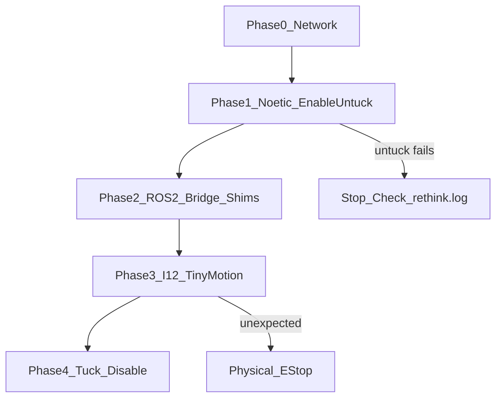

# Real Robot Verification (Path C)

## Context

| Gate | Status |
|------|--------|
| I10 non-motion | PASS |
| I11 safety interlock (disabled robot) | PASS |
| I12 supervised motion | **BLOCKED** — `enable_robot.py -e` fails while tucked |

Known facts from [docs/hardware_test_commands.md](docs/hardware_test_commands.md) and [logs/I12_supervised_hardware_motion.log.md](logs/I12_supervised_hardware_motion.log.md):

- Robot: `011412P0024.local` (DHCP IP moves; never hardcode)
- From tucked pose, `/diagnostics` shows `Collision detected on jointleft_s1` — expected
- Use **`tuck_arms.py -u`** (suppress collision + sustained enable), never `enable_robot.py -e` from tucked, never hand-publish `/robot/set_super_enable`
- Never hand-write trajectory points; use `sim_tiny_trajectory` with measured start
- Primary Noetic tool path: Docker `baxtool` (`baxter-noetic:n07`, `--network host`, `--add-host` for mDNS). Native `./baxter.sh` from [baxter_noetic](file:///home/yunusdanabas/baxter_noetic_ws/src/baxter_noetic/baxter/baxter.sh) is an equivalent alternate if Noetic is installed on the host



**Safety before any motion:** clear workspace, e-stop in hand, nobody in reach. Physical e-stop is primary.

---

## Phase 0 — Network (non-motion)

Every session starts here. All four must pass.

```bash
cd ~/baxter_ros2_jazzy

getent hosts 011412P0024.local
ping -c3 $(getent hosts 011412P0024.local | awk '{print $1}')
ip route get $(getent hosts 011412P0024.local | awk '{print $1}')
# expect: ... dev enp4s0 src 192.168.1.x   (NOT via wifi gateway)

timeout 3 bash -c "echo > /dev/tcp/$(getent hosts 011412P0024.local | awk '{print $1}')/11311" \
  && echo "11311 OPEN"
```

If route is wrong:

```bash
nmcli connection modify "Wired connection 1" ipv4.method auto
nmcli connection up "Wired connection 1"
```

Define `baxtool` once in the shell (from the command sheet):

```bash
baxtool() {
  local ip; ip=$(getent hosts 011412P0024.local | awk '{print $1}')
  docker run --rm -it --network host --add-host=011412P0024.local:"$ip" \
    -e ROS_MASTER_URI=http://"$ip":11311 \
    -e ROS_IP="$(ip route get "$ip" | grep -oP 'src \K\S+')" \
    baxter-noetic:n07 bash -lc \
    "source /root/baxter_ws/install/setup.bash && rosrun baxter_tools $*"
}
```

Prerequisite: `docker image inspect baxter-noetic:n07` succeeds (build from `~/baxter_noetic_ws/src/baxter_noetic` if missing).

Optional hardware-free pre-check (before going to the robot):

```bash
ros2 run baxter_hardware_bridge dry_run_test   # OVERALL: PASS
```

---

## Phase 1 — Pure Noetic proof (unblocks I12)

**Goal:** prove the robot can enable and leave the tucked collision field using only ROS 1 SDK tools. No ROS 2 bridge yet.

### 1a. Status (safe, read-only)

```bash
baxtool enable_robot.py -s
```

Expect: `enabled: False`, `estop_button: 0`, `error: False`. Do **not** run `enable_robot.py -e` while tucked.

### 1b. Enable + untuck (first supervised motion of the session)

Large whole-arm + head motion. E-stop ready.

```bash
baxtool tuck_arms.py -u
```

**Pass criteria:** command returns success; arms move to untuck targets (notably `s1 ≈ -1.0`); subsequent status shows enabled:

```bash
baxtool enable_robot.py -s
# want: enabled True, ready True
```

**If this hangs / never enables:** stop. Hypothesis was wrong. Next debug is robot-side (`ssh ruser@011412P0024.local` → check `rethink.log`, homing/calibration). Do **not** force `/robot/set_super_enable`. Do not start Phase 2/3.

### 1c. Optional Noetic sanity (still no ROS 2)

While enabled and untucked, optional tiny SDK check (pick one):

```bash
# status only is enough to proceed; if you want a Noetic motion sample:
# from a native Noetic shell after ./baxter.sh, or docker rosrun baxter_examples ...
# Prefer skipping extra motion and going to Phase 2–3 if time-constrained.
```

Then leave robot **enabled and untucked** for Phase 2, or tuck+disable and re-untuck later — leaving untucked is fine and saves a second large motion.

---

## Phase 2 — ROS 2 bridge + shims (non-motion until Phase 3)

Use three terminals. Every terminal:

```bash
cd ~/baxter_ros2_jazzy
source scripts/baxter_env.sh
```

### Terminal 1 — bridge

```bash
python3 scripts/py_bridge.py
```

Expect: `Bridge started: master=http://<ip>:11311 ip=<laptop>` and **no** `deserialize failed`.

### Terminal 2 — verify state over ROS 2

```bash
ros2 topic echo --once /robot/state
ros2 topic hz /robot/joint_states          # ~100 Hz
ros2 run baxter_hardware_bridge baxter_safety_check
# want: safe_for_motion=True  ready=True enabled=True
```

Optional sonar (resets on reboot):

```bash
python3 scripts/sonar_ctl.py off
```

### Terminal 3 — action shims

```bash
ros2 launch baxter_hardware_bridge hardware_bringup.launch.py
```

```bash
ros2 action list
# /robot/limb/left/follow_joint_trajectory
# /robot/limb/right/follow_joint_trajectory
```

Quick re-check that interlock still rejects bad goals (optional; already passed I11):

```bash
ros2 action send_goal /robot/limb/left/follow_joint_trajectory \
  control_msgs/action/FollowJointTrajectory \
  "{trajectory: {joint_names: [bogus], points: []}}"
# expect: REJECTED
```

---

## Phase 3 — I12 supervised motion (ROS 2)

**Only if** Phase 1 untuck passed and `baxter_safety_check` is safe.

### 3a. Reversible tiny trajectories (both arms)

```bash
cd ~/baxter_ros2_jazzy && source scripts/baxter_env.sh

ros2 run baxter_examples sim_tiny_trajectory --ros-args \
  -p left_action:=/robot/limb/left/follow_joint_trajectory \
  -p right_action:=/robot/limb/right/follow_joint_trajectory \
  -p joint_states_topic:=/robot/joint_states
```

Expect per arm: outbound + return verified within `0.02 rad`, then `Reversible trajectories verified for both arms`.

If you see `s1 start ... outside [-2.147, 1.047]`: arms still tucked — return to Phase 1.

### 3b. Cancel-and-hold

```bash
ros2 run baxter_examples sim_tiny_trajectory --ros-args \
  -p left_action:=/robot/limb/left/follow_joint_trajectory \
  -p right_action:=/robot/limb/right/follow_joint_trajectory \
  -p joint_states_topic:=/robot/joint_states \
  -p cancel_after_sec:=1.0
```

Expect: cancel message, arm holds (does not fall).

**I12 gate pass:** 3a + 3b both succeed under supervision. Then update [MASTER_PLAN.md](MASTER_PLAN.md) I12 → `completed` and [logs/I12_supervised_hardware_motion.log.md](logs/I12_supervised_hardware_motion.log.md) with evidence (after the session; not during live motion).

---

## Phase 4 — Shutdown

```bash
baxtool tuck_arms.py -t
baxtool enable_robot.py -d
```

Then Ctrl-C shims (terminal 3), then bridge (terminal 1).

---

## Abort cheatsheet

| Situation | Action |
|-----------|--------|
| Unexpected motion / wrong direction | **Physical e-stop** |
| Stop active ROS 2 goal | Ctrl-C `sim_tiny_trajectory` (shim holds last command) |
| Disable without tuck | `baxtool enable_robot.py -d` |
| Error state | `baxtool enable_robot.py -r`, then re-check `-s` |
| Untuck never enables | Stop; check robot `rethink.log` — do not hand-enable |

Do **not** publish `/robot/set_super_enable` or `/robot/set_super_stop` for routine control.

---

## What this plan does *not* change

This is an operator verification runbook, not a code step. No repo edits until I12 gate evidence exists. After a successful session, update I12 status/log only.
