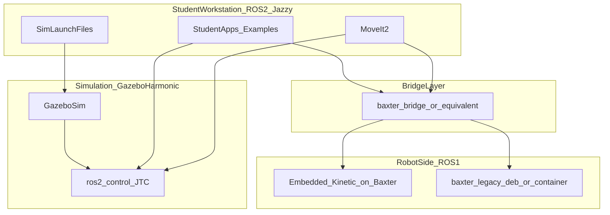

# Baxter ROS 2 Jazzy — Research Report

## Executive Summary

A **full native ROS 2 Jazzy port** of the entire Baxter SDK (hardware + simulation + MoveIt) is **not realistic** as a solo university project. The robot’s onboard computer still runs **ROS 1 Kinetic** firmware; Rethink Robotics is defunct with **no official ROS 2 path**; and **Gazebo Classic** (what your Noetic sim uses) reached EOL in January 2025.

What **is realistic** — and already proven in labs — is a **hybrid architecture**:

- **Students develop in ROS 2 Jazzy** (modern tooling, MoveIt 2, standard tutorials)
- **Real Baxter stays on ROS 1** at the robot boundary, reached via a **bridge** (not generic `ros1_bridge` on Ubuntu 24.04)
- **Simulation moves to Gazebo Harmonic** with `ros2_control`, accepting that sim APIs may differ from hardware unless you deliberately preserve Baxter’s `JointCommand` semantics

Your existing [Noetic repo](/home/yunusdanabas/Yunus Portfolio/ROS1/catkin_ws/src/baxter_noetic) is a strong asset for the **ROS 1 robot-side** and for understanding the topic API, but it does not remove the structural hardware constraint. The most mature community work ([CentraleNantesRobotics/baxter_common_ros2](https://github.com/CentraleNantesRobotics/baxter_common_ros2), [angysof16/BaxterMotionPlanning](https://github.com/angysof16/BaxterMotionPlanning)) should be treated as **reference implementations**, not drop-in replacements for your repo.

**Bottom line:** Proceed with a **separate Jazzy repo**, but scope it as a **teaching/distribution stack** (docs + dev environment + bridge + sim), not a line-by-line port of all 17 Catkin packages.

---

## 1. Feasibility

### What migration actually means for Baxter

Your Noetic stack has **17 packages**, ~73 Python files, ~22 C++ files (all simulation), 33 custom messages, 6 services, and **zero custom actions** (uses `control_msgs/FollowJointTrajectory`). Application code talks to the robot through a **stable `/robot/*` topic API** — the same API whether on hardware or Gazebo emulator.

That design helps a ROS 2 effort, but only **above the bridge**. Below it, the embedded Baxter controller is still ROS 1 Kinetic. [Open Robotics Discourse (Apr 2022)](https://discourse.openrobotics.org/t/using-baxter-after-2025/25272) documents that upgrading the embedded computer to ROS 2 was considered **infeasible/risky**; labs chose minimal ROS 1 + bridge instead.

### Major blockers

| Blocker | Severity | Notes |
|---------|----------|-------|
| Embedded ROS 1 Kinetic | **Hard** | Cannot be “ported” from workstation; flashing ROS 2 is unsupported |
| No official ROS 2 SDK | **Hard** | Rethink org inactive; no bloom releases for Baxter on Humble/Jazzy |
| `ros1_bridge` on Jazzy/Noble | **Hard** | Ubuntu 24.04 has no ROS 1; [ros1_bridge](https://github.com/ros2/ros1_bridge) explicitly unsupported on Noble+Jazzy |
| Custom `JointCommand` control | **Medium** | Real Baxter uses `baxter_core_msgs/JointCommand`, not raw `trajectory_msgs`; action servers translate in ROS 1 |
| Gazebo Classic sim stack | **Medium–High** | Custom C++ `gazebo_ros_control` plugin in `baxter_gazebo`; Classic EOL Jan 2025 |
| MoveIt 2 config | **Medium** | No upstream Baxter MoveIt 2; must regenerate from URDF/SRDF |
| Maintenance without vendor | **Ongoing** | No security patches for Baxter SDK, Classic Gazebo, or onboard stack |

### Existing community work (2022–2026)

**Real robot — most mature**

- [CentraleNantesRobotics/baxter_common_ros2](https://github.com/CentraleNantesRobotics/baxter_common_ros2) — ported msgs/URDF + custom **`baxter_bridge`** (precompiled Baxter message mappings; avoids rebuilding `ros1_bridge`). Actively maintained (pushed 2025–2026).
- [CentraleNantesRobotics/baxter_legacy](https://github.com/CentraleNantesRobotics/baxter_legacy) — Python 3 ROS 1 packages + **Debian packages** for Focal/Jammy/Noble robot-side install.
- [Baxterminator/ECN_Baxter](https://github.com/Baxterminator/ECN_Baxter) — course/lab wrappers (gripper abstraction, orchestration).

**Simulation + MoveIt 2 — most complete native ROS 2**

- [angysof16/BaxterMotionPlanning](https://github.com/angysof16/BaxterMotionPlanning) — **Jazzy + Gazebo Harmonic + ros2_control + MoveIt 2**; actively updated (2026). Uses standard `FollowJointTrajectory`, not Baxter-native `JointCommand`.

**Partial / abandoned**

- [JuanCSUCoder/baxter_interface_2](https://github.com/JuanCSUCoder/baxter_interface_2) — Humble C++ wrapper; 2 commits, 2023.
- [maxilar20/baxter_moveit_ros2](https://github.com/maxilar20/baxter_moveit_ros2) — Galactic + bridge; abandoned 2023.
- [CentraleNantesRobotics/baxter_gz](https://github.com/CentraleNantesRobotics/baxter_gz) — Gazebo Sim with **JointCommand-compatible** bridge; partial.

**ROS 1 sim on modern OS (not ROS 2, but relevant)**

- [dabaspark/baxter_sdk_nvidia_any_os](https://github.com/dabaspark/baxter_sdk_nvidia_any_os) — Dockerized Kinetic SDK + Classic Gazebo on Ubuntu 24.04; referenced in Discourse Jan 2025.

**Your Noetic repo**

- Aligns with ECN’s `baxter_legacy` direction (Python 3, physical + Gazebo Classic).
- Does **not** solve Jazzy workstation + Noble compatibility by itself.

### Realistic scope

| Scope | Realistic? | Effort (order of magnitude) |
|-------|------------|------------------------------|
| Full native ROS 2 on real Baxter | **No** | N/A |
| Jazzy student env + bridge to real robot | **Yes** | Weeks–months (integrate + document) |
| Gazebo Harmonic sim + MoveIt 2 | **Yes** | Person-months (adopt/extend community repo) |
| 1:1 port of all 17 packages to ament | **Partially** | Large; low ROI vs bridge for hardware |
| Bloom/rosdep installable “Baxter Jazzy” | **Unlikely soon** | Needs sustained maintainer + rosdistro acceptance |

---

## 2. Architecture

### Port vs rewrite

**Neither pure port nor full rewrite.** The winning pattern is **stratified**:

- **Hardware path:** Rewrite/port **student-facing** packages to ROS 2; **keep** robot-side ROS 1 minimal stack.
- **Sim path:** **Rewrite** simulation against Gazebo Sim + `gz_ros2_control` (Classic plugins do not migrate cleanly).

### Package mapping (your repo → ROS 2)

| Your package | ROS 2 approach | Priority |
|--------------|----------------|----------|
| `baxter_core_msgs`, `baxter_maintenance_msgs`, `baxter_description`, `rethink_ee_description` | Port to `baxter_common_ros2` (exists) or fork | **High** — foundation |
| `baxter_interface` | Thin ROS 2 Python API over bridged topics **or** keep ROS 1 on robot + bridge only | **High** for ergonomics; not required if students use raw topics/actions |
| `baxter_tools` | Port enable/tuck/camera scripts to ROS 2 **or** invoke ROS 1 via bridge | **High** for onboarding |
| `baxter_examples` | Rewrite key tutorials in rclpy; drop project-specific PnP unless needed | **High** for students |
| `baxter_moveit_config` | Regenerate MoveIt 2 config (Setup Assistant); reference `BaxterMotionPlanning` | **Medium** — sim-first |
| `baxter_simulator/*` (6 packages) | **Replace**, not port — new Gazebo Sim + ros2_control stack | **Medium** — sim users |
| `baxter.sh` | Replace with ROS 2 launch + env docs / devcontainer | **High** for UX |

### Simulation stack choice

| Option | Pros | Cons |
|--------|------|------|
| **Gazebo Harmonic + ros2_control** (`BaxterMotionPlanning` model) | Standard ROS 2 manipulator stack; Jazzy-official pairing; MoveIt 2 works | **Different control path** from real Baxter (`JointCommand` vs JTC) |
| **Gazebo Sim + JointCommand bridge** (`baxter_gz` model) | Same message semantics as hardware; easier “code runs on both” | Less standard; more custom maintenance; gripper/IO less complete |
| **Classic Gazebo in Docker** (`dabaspark` model) | Preserves your Noetic sim verbatim | ROS 1 inside container; not a true Jazzy sim; Classic EOL |

**Recommendation:** Default teaching sim = **Harmonic + ros2_control + MoveIt 2**. Offer optional **hardware-faithful** sim layer later if you need identical APIs.

### MoveIt

- MoveIt 1 config in your repo is standard bulk (OMPL/CHOMP/STOMP pipelines).
- MoveIt 2 requires new config; no entry in `moveit_resources`.
- Community Jazzy config exists in `BaxterMotionPlanning`; treat as starting point, not canonical upstream.

### Distro note: Jazzy vs Humble

- **Jazzy (Noble, LTS to ~2029):** Best long-term for new students; **forces** containerized/deb ROS 1 for Baxter hardware.
- **Humble (Jammy, LTS to ~2027):** Easier `ros1_bridge` on 22.04 (build from source); shorter horizon.

For “easy to find and use globally,” **Jazzy is correct** — but document the **dual-stack reality** upfront.

---

## 3. Real Robot vs Simulation

### What must work on hardware (minimum viable for your university)

1. **Robot enable / disable / estop / state** (`baxter_tools` enable flow)
2. **Arm joint motion** — position/velocity commands via `/robot/limb/*/joint_command` or bridged `FollowJointTrajectory`
3. **Untuck / tuck** — safety onboarding for new students
4. **At least one camera stream** — vision labs
5. **Basic gripper open/close** — manipulation demos
6. **Network setup docs** — `ROS_MASTER_URI`, robot hostname, firewall (today’s `baxter.sh` model)

**Important for hardware:** `FollowJointTrajectory` on real Baxter still depends on ROS 1 **`joint_trajectory_action_server.py`** in `baxter_interface`; bridge must expose actions or equivalent topics.

### What can be simulation-first

- **MoveIt 2** motion planning demos
- **Standard ros2_control** trajectories
- **New tutorials** (pick-place in Gazebo, RViz-only intros)
- **CI** (headless sim tests)
- **Modern interfaces** (lifecycle nodes, composable nodes) — sim only initially

### Gaps between sim and hardware

| Capability | Hardware (ROS 1 API) | Typical ROS 2 sim |
|------------|---------------------|-------------------|
| Joint control | `JointCommand` + mode field | `FollowJointTrajectory` via JTC |
| Enable / fault handling | `/robot/state`, enable services | Often skipped in sim |
| Grippers | `EndEffectorCommand`, custom action servers | Often unmodeled or simplified |
| Head / face display | Custom msgs + actions | Partial in sim projects |
| Navigator buttons / IO | Digital/analog IO topics | Rarely ported |
| On-robot IK service | `SolvePositionIK` srv | MoveIt IK in sim instead |
| Cameras | Multiple calibrated streams | Bridged Gazebo sensors |

**Student impact:** Code written against **standard ROS 2 manipulator patterns** will transfer to sim easily but may need **thin adapters** for hardware. Code copied from Noetic `baxter_interface` may work on hardware (via bridge) but not in Harmonic sim without shims.

**Mitigation (conceptual):** Document two “personalities” — **HardwareMode** (bridged Baxter API) and **SimMode** (ros2_control + MoveIt 2) — with shared high-level examples where possible.

---

## 4. Improvements Worth Adding (prioritized)

Beyond a straight port, these deliver the most value for **students** and **external users**:

### Tier 1 — highest ROI

1. **Single “Getting Started” doc** — 15-minute path: devcontainer → sim demo → (optional) real robot checklist. Replace scattered wiki/dead Rethink links.
2. **Devcontainer for Jazzy + Harmonic** — Pattern from [ROS Jazzy VS Code Docker guide](https://docs.ros.org/en/jazzy/How-To-Guides/Setup-ROS-2-with-VSCode-and-Docker-Container.html) and templates like [athackst/vscode_ros2_workspace](https://github.com/athackst/vscode_ros2_workspace). Removes “works on my laptop” friction.
3. **Pinned `.repos` file** — Vendoring/forking `baxter_common_ros2`, sim stack, and your additions with known-good SHAs.
4. **3–5 curated examples** — enable+untuck (hardware), joint motion, camera view, MoveIt pick-place (sim), one “bridge smoke test.” Better than porting all ~73 Python files.
5. **Clear repo naming and README badge** — e.g. `baxter_ros2_jazzy` on GitHub; link from Noetic README (“looking for ROS 2? → here”) without modifying Noetic code behavior.

### Tier 2 — strong for external adoption

6. **Prebuilt robot-side Debian or Docker image** — Follow ECN model ([baxter_legacy debs](https://github.com/CentraleNantesRobotics/baxter_legacy)); students never compile ROS 1 on Noble.
7. **CI** — colcon build + lint + headless Gazebo smoke launch (even if flaky, catches breakage).
8. **Hardware vs sim launch profiles** — One command each; no manual `baxter.sh` tribal knowledge.
9. **Contributing / code of conduct / issue templates** — Signals “community-maintained” vs abandoned fork.

### Tier 3 — nice later

10. Thin **`baxter_py`** ROS 2 API mirroring familiar `Limb`/`Gripper` names
11. **Zenoh/multi-machine** (as in `BaxterMotionPlanning` roadmap) — only if you need distributed labs
12. **Web viz (Foxglove)** — modern alternative to `image_view`
13. **Docker Compose** orchestrating bridge + sim + student shell

**Deprioritize:** Porting all maintenance/calibration tools, full IO/navigator sim, bloating to match every Noetic example.

---

## 5. Risks and Unknowns

### Hardware and vendor

- **Baxter is discontinued** (Rethink shut down 2018). HAHN Group acquired **Sawyer/INTERA**, not Baxter support path for research robots.
- **Aging hardware** — joint encoders, grippers, embedded PC storage; spare parts uncertain.
- **Embedded computer** — Kinetic-era; no tested ROS 2 upgrade path.

### Software EOL chain

- ROS Noetic EOL **May 2025**
- Gazebo Classic 11 EOL **January 2025**
- Jazzy on Noble **cannot** run `ros1_bridge` natively

### Licensing

- Original Baxter SDK packages use **BSD** (typical Rethink headers). Community forks (ECN, etc.) appear compatible. **No blocker identified**, but preserve LICENSE files in the Jazzy copy and note third-party origins.

### Maintenance burden

Expect **part-time continuous ownership**, not a one-time migration:

- Ubuntu/ROS distro bumps every 2 years
- Bridge topic allowlists when students add packages
- Sim fragility (Gazebo + GPU + CI)
- No upstream security patches for Baxter-specific code
- Bus factor: expertise in **both** ROS generations + Docker networking

### Technical unknowns

- Whether your specific Baxter firmware/network config matches ECN bridge assumptions
- Gripper model (electric vs pneumatic) in sim vs lab
- Performance/latency of bridge for teleop or closed-loop control
- Legal/IT policies for Docker + host networking in your university labs

---

## 6. Recommendation

### Is a full Jazzy port realistic?

**No** — if “full port” means native ROS 2 on the robot, all packages ament-ized, and feature parity with Noetic including Classic Gazebo.

**Yes** — if scoped as a **distribution and teaching stack** that makes Baxter usable in 2026+:

| Audience | Deliverable |
|----------|-------------|
| Your university (real robot) | Jazzy devcontainer + documented bridge + ROS 1 robot-side deb/container + minimal hardware tutorials |
| Other schools | Public repo, pinned deps, ECN-compatible bridge story, issue tracker |
| No hardware | Gazebo Harmonic + MoveIt 2 sim (adopt/extend `BaxterMotionPlanning` or similar) |

### Phased outcome (conceptual — not implementation steps)

**Phase A — “Students can start in a week”**

- Separate repo fork/copy with README, devcontainer, `.repos`, bridge docs
- Integrate **`baxter_common_ros2`** + robot-side **`baxter_legacy`** pattern
- Port or rewrite **enable, untuck, basic arm motion, camera** examples for ROS 2
- Link from Noetic README only (Noetic repo unchanged)

**Phase B — “Sim-only users worldwide”**

- Gazebo Harmonic stack + MoveIt 2 demo launch
- CI smoke test
- Document sim vs hardware API differences honestly

**Phase C — “Polish and community”**

- Unified Python facade (optional)
- Gripper/head in sim; more examples
- Consider rosdistro submission for msg packages only (long shot)

### What not to do

- Do not attempt **embedded ROS 2 flash** without dedicated hardware R&D budget.
- Do not rely on **`ros1_bridge` on Ubuntu 24.04** — use ECN-style **`baxter_bridge`** or ROS 1 in container on 22.04 bridge machine.
- Do not port **`baxter_gazebo` Classic plugins** line-by-line — budget for Gazebo Sim rewrite or adopt existing ROS 2 sim repo.

### Strategic fit with your Noetic repo

Keep Noetic as the **reference ROS 1 stack** for labs already on Noetic/Focal/Jammy and for Gazebo Classic workflows. The Jazzy repo becomes the **forward-looking entry point** for new students on Noble, with explicit bridging to the same physical robot.

---

## Open Questions (for you before any build phase)

1. **Target Ubuntu for student laptops?** Noble/Jazzy only, or also support Jammy/Humble for easier bridging experiments?
2. **Bridge machine topology?** One lab PC always running ROS 1 bridge, or per-student bridge containers?
3. **Sim fidelity requirement?** Is standard `ros2_control` + MoveIt 2 enough, or must sim mirror `JointCommand` for homework parity?
4. **Gripper/end-effector** on your physical Baxter — which URDF variant (`rethink_ee_description`)?
5. **Relationship to ECN repos?** Fork and customize vs contribute upstream vs thin wrapper repo?
6. **Who maintains it after you graduate?** Sustainable handoff (deb rebuild scripts, CI, one-page ops runbook) matters more than feature count.

---

## Key References

- Your repo: [baxter_noetic](/home/yunusdanabas/Yunus Portfolio/ROS1/catkin_ws/src/baxter_noetic) — 17 packages, Python SDK + Classic Gazebo sim
- [Using Baxter after 2025 (Open Robotics Discourse)](https://discourse.openrobotics.org/t/using-baxter-after-2025/25272)
- [CentraleNantesRobotics/baxter_common_ros2](https://github.com/CentraleNantesRobotics/baxter_common_ros2)
- [CentraleNantesRobotics/baxter_legacy](https://github.com/CentraleNantesRobotics/baxter_legacy)
- [angysof16/BaxterMotionPlanning](https://github.com/angysof16/BaxterMotionPlanning) — Jazzy + Harmonic + MoveIt 2
- [ros1_bridge compatibility matrix](https://github.com/ros2/ros1_bridge)
- [Migrating from ROS 1 to ROS 2 (Jazzy docs index)](https://docs.ros.org/en/jazzy/How-To-Guides/Migrating-from-ROS1.html)
- [Gazebo Classic EOL announcement](https://discourse.openrobotics.org/t/gazebo-classic-11-has-reached-end-of-life/48458)
- [dabaspark/baxter_sdk_nvidia_any_os](https://github.com/dabaspark/baxter_sdk_nvidia_any_os) — Docker ROS 1 SDK on modern Ubuntu
