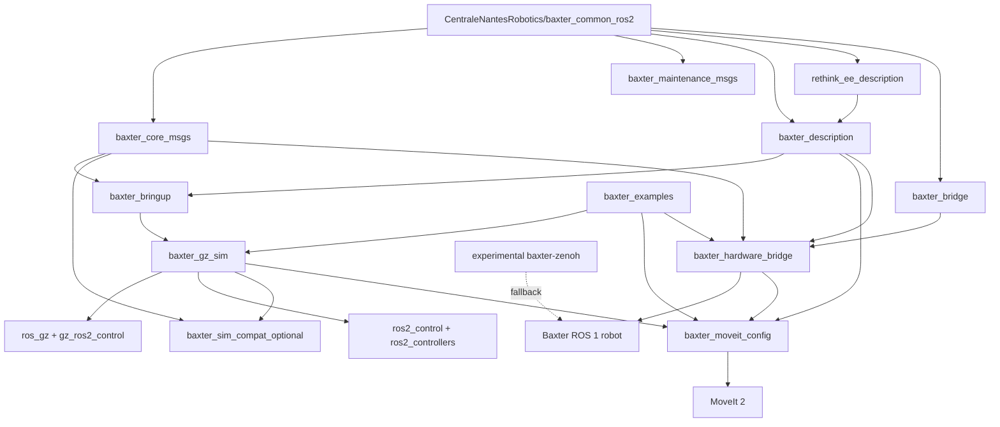

# S08: Package Mapping and Dependency Graph

## Task

Finalized the package-by-package mapping and dependency graph for the future `baxter_ros2_jazzy` workspace. This step is design-only: no ROS 2 package code, launch files, configs, or repository files were implemented.

Inputs read first:

- `EXISTING_RESEARCH.md`
- `logs/S01_validate_assumptions.log.md`
- `logs/S02_audit_community_packages.log.md`
- `logs/S03_local_repo_analysis.log.md`
- `logs/S04_bridge_architecture.log.md`
- `logs/S05_simulation_architecture.log.md`
- `logs/S06_moveit_ros2_control.log.md`
- `logs/S07_dev_experience_tooling.log.md`
- `MASTER_PLAN.md`

No changes were made to `baxter_noetic_ref/`.

## Findings

### Executive Summary

The future workspace should stay small and profile-oriented. Adopt the licensed ECN common packages for Baxter interfaces and descriptions, create only the local packages needed for bringup, Gazebo Harmonic simulation, optional compatibility, MoveIt 2, hardware bridge shims, and curated examples, and keep bridge-host dependencies out of normal sim CI.

Default graph:

| Profile | Default Package Set | Excluded By Default |
|---|---|---|
| Core/model | ECN `baxter_core_msgs`, `baxter_maintenance_msgs`, `baxter_description`, `rethink_ee_description`; local `baxter_bringup` | Hardware bridge, Gazebo, Zenoh |
| Sim | Core/model + local `baxter_gz_sim` + external `ros_gz`, `gz_ros2_control`, `ros2_control`, `ros2_controllers` | Hardware bridge, direct `JointCommand` sim support |
| MoveIt | Core/model + local regenerated `baxter_moveit_config` + external MoveIt 2 | Hardware execution unless hardware profile selected |
| Hardware bridge | Core/model + ECN `baxter_bridge` + local `baxter_hardware_bridge` | Gazebo sim dependencies in bridge-host-only setup |
| Experimental | Explicit opt-in `baxter-zenoh`, `BaxterSDK`, optional `baxter_gz` reference | Never imported by default |

The shortest safe package graph is:

- Adopt one community repo by default: `CentraleNantesRobotics/baxter_common_ros2` at S02 candidate SHA `678bfabea8c895b4134951a6c076217a90b9e0e6`.
- Create five first-release local packages: `baxter_bringup`, `baxter_gz_sim`, `baxter_moveit_config`, `baxter_hardware_bridge`, and `baxter_examples`; add optional `baxter_sim_compat` only if course/API parity needs it.
- Do not create a first-release `baxter_smoke_tests` package unless smoke commands grow large. Fold generic smoke launch/checks into `baxter_bringup` and hardware-specific checks into `baxter_hardware_bridge`.

### Mapping Of All 17 Noetic Packages

| Noetic Package | Future Mapping | Category | Notes |
|---|---|---|---|
| `baxter_common/baxter_common` | Covered by imported ECN common repo and workspace docs; no local metapackage required | Adopted ROS 2 package group | Metadata-only Noetic package. A future ROS 2 metapackage is optional, not first-release necessary. |
| `baxter_common/baxter_core_msgs` | `baxter_core_msgs` from `CentraleNantesRobotics/baxter_common_ros2` | Adopted ROS 2 package | Default core dependency. Bridge contract for `JointCommand`, `AssemblyState`, `EndEffector*`, `EndpointState`, camera services, IK service, and bridge arbitration messages/services. |
| `baxter_common/baxter_description` | `baxter_description` from ECN common, with local sim overlays in `baxter_gz_sim` if needed | Adopted ROS 2 package plus local overlay | Preserve geometry and legacy names. Replace Classic Gazebo plugin assumptions outside the adopted package. |
| `baxter_common/baxter_maintenance_msgs` | `baxter_maintenance_msgs` from ECN common | Adopted ROS 2 package, workflows deferred | Keep interface package because it comes with common dependency. Do not expose tare/calibration/update workflows to beginner docs. |
| `baxter_common/rethink_ee_description` | `rethink_ee_description` from ECN common | Adopted ROS 2 package | Preserve end-effector geometry; ROS 2 gripper control config lives in `baxter_gz_sim` / `baxter_moveit_config`. |
| `baxter/baxter_sdk` | Replaced by workspace layout, docs, `.repos`, devcontainer, and launch profiles | Dropped/replaced | Do not recreate `baxter.sh` or a ROS 1-style SDK metapackage. |
| `baxter_interface` | Minimal ROS 2 subset in `baxter_hardware_bridge`; examples in `baxter_examples`; optional future facade only if users need it | Simplified subset in another package | Preserve `RobotEnable` semantics, hardware action shims, safe `JointCommand` use, gripper command/state basics. Do not port full class surface initially. |
| `baxter_tools` | `baxter_hardware_bridge` for enable/status/smoke/camera checks; `baxter_bringup` for launch entry points | Simplified subset in another package | Keep safe enable/status, hardware smoke, camera list/open/close. Drop maintenance/admin tools from first release. |
| `baxter_examples` | New local `baxter_examples` | New local ROS 2 package | Curated examples only: tiny sim trajectory, sim MoveIt neutral, hardware bridge smoke wrapper, safe hardware enable/status, optional gripper open/close. |
| `baxter_moveit_config` | New regenerated local `baxter_moveit_config` | New local ROS 2 package | MoveIt 2 config generated from final ROS 2 description. Preserve groups and names, not old MoveIt 1 launch/plugins. |
| `baxter_simulator/baxter_simulator` | Replaced by `baxter_gz_sim` profile docs; no metapackage required | Dropped/deferred package | Classic Gazebo metapackage only. |
| `baxter_simulator/baxter_gazebo` | New local `baxter_gz_sim` | New local ROS 2 package | Gazebo Harmonic worlds, launch, `ros_gz_bridge`, `gz_ros2_control`, controller YAML. No Classic plugin port. |
| `baxter_simulator/baxter_sim_controllers` | External `ros2_control` / `ros2_controllers`; configs in `baxter_gz_sim`; optional shim in `baxter_sim_compat` | External apt/rosdep dependency | Use `joint_trajectory_controller`, `joint_state_broadcaster`, optional gripper/head controllers. Do not recreate custom ROS 1 controllers. |
| `baxter_simulator/baxter_sim_examples` | New local `baxter_examples` | Simplified subset in another package | Replace Classic pick-place/spawn demos with standard sim and MoveIt examples. |
| `baxter_simulator/baxter_sim_hardware` | `gz_ros2_control` plus optional `baxter_sim_compat` state/topic shims | External dependency plus optional local package | No fake hardware emulator port. Publish only small compatibility surface if needed. |
| `baxter_simulator/baxter_sim_io` | Not recreated | Dropped/deferred package | Qt IO/navigator simulator is out of first-release scope. Add only for a concrete course need. |
| `baxter_simulator/baxter_sim_kinematics` | MoveIt 2 KDL for sim; optional wrapper over MoveIt `compute_ik` or hardware `SolvePositionIK` later | Dropped/deferred package | Do not port KDL/Gazebo Classic service node. Old IK service parity is optional compatibility work. |

### Future Local Packages

| Package | Role | Build Type | Source Status | First-Release Priority | Main Dependencies |
|---|---|---|---|---|---|
| `baxter_bringup` | Top-level launch/profile aggregation, model launch, shared args, generic smoke launch wrappers | Config-only `ament_cmake` | New local | High | `launch_ros`, `xacro`, `robot_state_publisher`, `tf2_ros`, `baxter_description`, `rethink_ee_description` |
| `baxter_gz_sim` | Gazebo Harmonic worlds, sim overlay xacro, `ros_gz_bridge` mappings, controller YAML, `sim.launch.py`, `smoke_sim.launch.py` | Config-only `ament_cmake` | New local | High for sim | `ros_gz_sim`, `ros_gz_bridge`, `gz_ros2_control`, `controller_manager`, `ros2_control`, `ros2_controllers`, `joint_state_broadcaster`, `joint_trajectory_controller`, `baxter_description` |
| `baxter_sim_compat` | Optional `/robot/*` compatibility layer in sim: `/robot/joint_states`, `/robot/state`, optional endpoint/gripper/camera shims, optional safe position-only `JointCommand` shim | `ament_python` | New local, optional | Medium/optional | `rclpy`, `baxter_core_msgs`, `sensor_msgs`, `control_msgs`, `trajectory_msgs`, `tf2_ros` |
| `baxter_moveit_config` | Regenerated MoveIt 2 package: SRDF, kinematics, OMPL, RViz, fake/sim/hardware controller YAMLs, `moveit_rviz.launch.py` | Config-only `ament_cmake` | New local | High for MoveIt | `moveit_ros_move_group`, `moveit_ros_visualization`, `moveit_kinematics`, `moveit_planners_ompl`, `xacro`, `robot_state_publisher`, `baxter_description`, `rethink_ee_description`, `control_msgs` |
| `baxter_hardware_bridge` | Hardware bridge-host launch, ROS 2 `FollowJointTrajectory` action shims, optional gripper/head shims, safe enable/status tools, hardware non-motion checks | `ament_python` | New local | High for hardware | `rclpy`, `baxter_core_msgs`, `control_msgs`, `trajectory_msgs`, `sensor_msgs`, `std_msgs`, `std_srvs`, `diagnostic_msgs`, `tf2_ros`, ECN `baxter_bridge` in hardware profile |
| `baxter_examples` | Curated student examples and tutorial commands | `ament_python` | New local | High | `rclpy`, `control_msgs`, `trajectory_msgs`, `sensor_msgs`, `baxter_core_msgs`; profile deps on `baxter_gz_sim`, `baxter_moveit_config`, or `baxter_hardware_bridge` depending on example |
| `baxter_smoke_tests` | Optional standalone smoke command package if checks outgrow bringup/hardware packages | `ament_python` | Deferred optional | Low initially | Same as `baxter_examples` plus MoveIt/Gazebo/hardware profile dependencies |

### Adopted Community Packages

| Repo | Package Names | Pinned Source Strategy | Default/Profile | License Caveats |
|---|---|---|---|---|
| `CentraleNantesRobotics/baxter_common_ros2` | `baxter_core_msgs`, `baxter_maintenance_msgs`, `baxter_description`, `rethink_ee_description`, `baxter_bridge` | Import the repo via `repos/baxter_core.repos` at full SHA `678bfabea8c895b4134951a6c076217a90b9e0e6` unless S11 verifies a newer revision | Default for core/model packages; `baxter_bridge` used only by hardware bridge profile | BSD-3-Clause detected in S02. Still validate exact package manifests during implementation. |

### Optional, Fallback, And Reference-Only Sources

| Source | Status | Why Not Default | Profile That May Pull It In |
|---|---|---|---|
| `CentraleNantesRobotics/baxter_legacy` | Bridge-host-only packaging reference | Missing top-level license signal from S02; ROS 1 robot-side/support repo, not ROS 2 student API | `repos/baxter_hardware.repos` only after license verification and bridge-host packaging decision |
| `RethoughtRobotics/baxter-zenoh` | Experimental fallback | Very new, low adoption, broad topic YAML, Docker/Zenoh/IT risk, no ECN arbitration | `repos/baxter_experimental.repos` under `experimental_zenoh` |
| `RethoughtRobotics/BaxterSDK` | Reference/fallback | Very new, depends on Zenoh path, low adoption; duplicates local package roles | `repos/baxter_experimental.repos` only for comparison/prototyping |
| `RethoughtRobotics/ros1_bridge` | Transitive reference for Zenoh path | Custom fork, not standalone project dependency | Only inside a pinned Zenoh bridge container/workflow, not normal workspace graph |
| `CentraleNantesRobotics/baxter_gz` | Reference for optional sim compatibility | Narrow MIT repo, low adoption, JointCommand-specific sim path is not default | Optional `sim_compat` research/reference; not needed for default build |
| `angysof16/BaxterMotionPlanning` | Reference-only | No detected license. Best Jazzy/Harmonic/MoveIt reference, but do not vendor/copy | No `.repos` entry unless license is added |
| `bornaparo/baxter_moveit_config`, `maxilar20/baxter_moveit_ros2`, `JuanCSUCoder/baxter_interface_2` | Skipped | Stale, partial, unlicensed or superseded | None |
| `dabaspark/baxter_sdk_nvidia_any_os` | Emergency legacy reference | No detected license; ROS 1 Kinetic/Classic container, not Jazzy-native | Documentation/risk fallback only |

### Profile-Oriented Dependency Graph

Core/model profile:

```text
baxter_bringup
  -> baxter_description
  -> rethink_ee_description
  -> robot_state_publisher, xacro, tf2_ros

baxter_description
  -> rethink_ee_description

baxter_core_msgs
  -> std_msgs, sensor_msgs, geometry_msgs
```

Simulation profile:

```text
baxter_gz_sim
  -> baxter_bringup
  -> baxter_description
  -> ros_gz_sim, ros_gz_bridge
  -> gz_ros2_control
  -> controller_manager
  -> joint_state_broadcaster
  -> joint_trajectory_controller
  -> optional gripper/head controllers from ros2_controllers
```

Simulation compatibility profile:

```text
baxter_sim_compat
  -> baxter_gz_sim
  -> baxter_core_msgs
  -> sensor_msgs, control_msgs, trajectory_msgs
  -> tf2_ros
```

MoveIt profile:

```text
baxter_moveit_config
  -> baxter_description
  -> rethink_ee_description
  -> MoveIt 2 packages
  -> moveit_kinematics / KDL
  -> control_msgs

sim_moveit
  -> baxter_gz_sim
  -> baxter_moveit_config
  -> move_group, RViz
```

Hardware bridge profile:

```text
baxter_hardware_bridge
  -> baxter_core_msgs
  -> baxter_description
  -> ECN baxter_bridge
  -> control_msgs, trajectory_msgs, sensor_msgs, std_msgs, std_srvs, diagnostic_msgs
  -> robot_state_publisher, tf2_ros
  -> bridge-host ROS 1 support deps outside ordinary sim CI
```

Hardware MoveIt profile:

```text
hardware_moveit
  -> baxter_hardware_bridge
  -> baxter_moveit_config
  -> MoveIt 2 packages
  -> hardware action shims at /robot/limb/{left,right}/follow_joint_trajectory
```

Examples and smoke checks:

```text
baxter_examples
  -> baxter_core_msgs
  -> control_msgs, trajectory_msgs
  -> baxter_gz_sim for sim examples
  -> baxter_moveit_config for MoveIt examples
  -> baxter_hardware_bridge for hardware examples

smoke checks
  -> baxter_bringup for model/build checks
  -> baxter_gz_sim for sim/controller checks
  -> baxter_hardware_bridge for hardware non-motion/action availability checks
```

Experimental Zenoh profile:

```text
experimental_zenoh
  -> RethoughtRobotics/baxter-zenoh
  -> RethoughtRobotics/BaxterSDK, optional/reference
  -> rmw_zenoh_cpp or selected Zenoh runtime
  -> restricted bridge topic YAML before any student use
```

Mermaid overview:



### Dependency Groups By Profile

| Profile | Local Packages | Adopted Packages | External ROS/Gazebo/MoveIt Dependencies |
|---|---|---|---|
| Core/model | `baxter_bringup` | `baxter_core_msgs`, `baxter_maintenance_msgs`, `baxter_description`, `rethink_ee_description` | `xacro`, `robot_state_publisher`, `tf2_ros`, `sensor_msgs`, `geometry_msgs`, `std_msgs`, `diagnostic_msgs`, RViz/model tools as needed |
| Sim | `baxter_gz_sim` | Core/model adopted packages | `ros_gz`, `ros_gz_sim`, `ros_gz_bridge`, `gz_ros2_control`, `ros2_control`, `ros2_controllers`, `controller_manager`, `joint_state_broadcaster`, `joint_trajectory_controller`, optional gripper/head controllers |
| Sim compatibility | `baxter_sim_compat` | `baxter_core_msgs` | `rclpy`, `control_msgs`, `trajectory_msgs`, `sensor_msgs`, `tf2_ros` |
| MoveIt | `baxter_moveit_config` | `baxter_description`, `rethink_ee_description` | `moveit`, `moveit_ros_move_group`, `moveit_ros_visualization`, `moveit_kinematics`, OMPL, KDL plugin, RViz |
| Hardware bridge | `baxter_hardware_bridge` | Core packages + `baxter_bridge` | Bridge-host ROS 1 support deps, `rclpy`, `control_msgs`, `trajectory_msgs`, `sensor_msgs`, `std_srvs`, `tf2_ros`, `robot_state_publisher`, `cv_bridge` / `image_transport` if camera tools ship |
| Hardware MoveIt | `baxter_hardware_bridge`, `baxter_moveit_config` | Core packages + `baxter_bridge` | MoveIt 2 packages, RViz, action/service/client deps above |
| Examples | `baxter_examples` | Core packages | `rclpy`, `control_msgs`, `trajectory_msgs`, optional MoveIt Python/C++ APIs, optional camera/CV deps |
| Smoke tests | Fold into `baxter_bringup`, `baxter_gz_sim`, `baxter_hardware_bridge`; optional `baxter_smoke_tests` later | Core packages | Same profile deps being tested |
| Experimental Zenoh | None required in default graph | None default | `rmw_zenoh_cpp`, `baxter-zenoh`, `BaxterSDK`, forked bridge/container deps only by explicit opt-in |

### Launch Profile Ownership

| Launch Profile | Owning Package | Includes/Depends On | Notes |
|---|---|---|---|
| `baxter_description.launch.py` | `baxter_bringup` | `baxter_description`, `rethink_ee_description`, `robot_state_publisher` | Model-only sanity launch. |
| `moveit_rviz.launch.py` | `baxter_moveit_config` | `baxter_description`, MoveIt 2, RViz, fake/planning-only controller config | No Gazebo or hardware. |
| `sim.launch.py` | `baxter_gz_sim` | `baxter_bringup`, Gazebo Harmonic, `gz_ros2_control`, controllers | Standard sim without MoveIt. |
| `sim_moveit.launch.py` | `baxter_bringup` | `baxter_gz_sim`, `baxter_moveit_config` | Top-level combined profile; waits for sim controllers before executable MoveIt. |
| `sim_compat.launch.py` | `baxter_sim_compat` | `baxter_gz_sim`, `baxter_core_msgs` | Optional compatibility profile only. |
| `hardware_bridge.launch.py` | `baxter_hardware_bridge` | ECN `baxter_bridge`, action shims, `robot_state_publisher`, non-motion monitors | Bridge-host only. |
| `hardware_moveit.launch.py` | `baxter_hardware_bridge` | `hardware_bridge.launch.py`, `baxter_moveit_config` hardware controller YAML | Does not enable robot automatically. |
| `smoke_sim.launch.py` | `baxter_gz_sim` | Headless sim, model, controller checks | CI/manual sim smoke. |
| `smoke_hardware.launch.py` | `baxter_hardware_bridge` | Hardware non-motion checks only | Bridge-host only; no enable and no trajectory goal. |

### Controller And Action Name Ownership

| Name | Defined In Future File/Package | Profile | Notes |
|---|---|---|---|
| `joint_state_broadcaster` | `baxter_gz_sim/config/ros2_controllers.yaml` | Sim | Active at launch. |
| `left_arm_controller` | `baxter_gz_sim/config/ros2_controllers.yaml` | Sim | `joint_trajectory_controller/JointTrajectoryController`; joints `left_s0`...`left_w2`. |
| `right_arm_controller` | `baxter_gz_sim/config/ros2_controllers.yaml` | Sim | `joint_trajectory_controller/JointTrajectoryController`; joints `right_s0`...`right_w2`. |
| `/left_arm_controller/follow_joint_trajectory` | `left_arm_controller` and `baxter_moveit_config/config/moveit_controllers_sim.yaml` | Sim MoveIt | Canonical sim action name. |
| `/right_arm_controller/follow_joint_trajectory` | `right_arm_controller` and `baxter_moveit_config/config/moveit_controllers_sim.yaml` | Sim MoveIt | Canonical sim action name. |
| `head_controller` | `baxter_gz_sim/config/ros2_controllers.yaml` | Optional sim | JTC for `head_pan`; outside first-release MoveIt groups. |
| `left_gripper_controller`, `right_gripper_controller` | `baxter_gz_sim/config/ros2_controllers.yaml` | Optional sim | Use gripper action/position controllers if electric grippers are modeled. |
| `/robot/limb/left/follow_joint_trajectory` | `baxter_hardware_bridge/config/action_shims.yaml` or package params; `baxter_moveit_config/config/moveit_controllers_hardware.yaml` | Hardware MoveIt | Canonical hardware action shim name. |
| `/robot/limb/right/follow_joint_trajectory` | `baxter_hardware_bridge/config/action_shims.yaml` or package params; `baxter_moveit_config/config/moveit_controllers_hardware.yaml` | Hardware MoveIt | Canonical hardware action shim name. |
| `/robot/limb/{side}/joint_command` | ECN bridge allowlist and `baxter_hardware_bridge` shim output | Hardware bridge | Baxter-native command topic stays visible for advanced use. |
| `/robot/joint_states` -> `/joint_states` | `baxter_hardware_bridge` relay/remap config | Hardware MoveIt | One authoritative source only. |
| `/robot/joint_states`, `/robot/state` mirrors | `baxter_sim_compat/config/compat.yaml` | Sim compatibility | Optional compatibility layer. |

### Example Ownership

| Example | Package Home | Dependencies | Notes |
|---|---|---|---|
| `sim_tiny_trajectory` | `baxter_examples` | `rclpy`, `control_msgs`, `trajectory_msgs`, active `baxter_gz_sim` arm controller | Sends a tiny FJT goal to `/left_arm_controller/follow_joint_trajectory` or `/right_arm_controller/follow_joint_trajectory`. |
| `sim_moveit_neutral` | `baxter_examples` | `baxter_moveit_config`, MoveIt 2 APIs/launch, `baxter_gz_sim` if executing | Plans/executes one arm to `left_neutral` or `right_neutral` in sim. |
| `hardware_bridge_smoke` | `baxter_hardware_bridge` command, documented from `baxter_examples` tutorial | `baxter_core_msgs`, `sensor_msgs`, `control_msgs`, camera/gripper service clients | No enable and no motion. Checks state, joint states, services, and action availability. |
| `hardware_enable_status` | `baxter_hardware_bridge` command, documented from `baxter_examples` tutorial | `baxter_core_msgs`, `std_msgs` | Safe wrapper for status/enable/disable with explicit operator confirmation. |
| `gripper_open_close` | `baxter_examples` | Sim gripper controller or hardware gripper shim; `control_msgs` or `baxter_core_msgs` depending profile | Optional until electric gripper hardware/model is confirmed. |

### Bridge-Host-Only Packages

These must not be required for ordinary sim CI, student default devcontainer builds, or model-only docs:

| Package/Source | Why Bridge-Host Only |
|---|---|
| ECN `baxter_bridge` | Talks to Baxter ROS 1 graph, uses bridge arbitration and ROS 1 support assumptions. |
| `baxter_hardware_bridge` | Contains action shims, enable/status tools, and real robot safety checks. Buildable in ROS 2, but runtime belongs on bridge host. |
| `CentraleNantesRobotics/baxter_legacy` | ROS 1 support/deb workflow only after license review. |
| `RethoughtRobotics/baxter-zenoh` | Docker/Zenoh fallback with host networking and IT constraints. |
| `RethoughtRobotics/BaxterSDK` | Experimental/reference path tied to Zenoh bridge. |

### Intentionally Not Recreated

Do not create first-release ROS 2 ports of:

- `baxter_gazebo` Classic Gazebo launch/plugins.
- `baxter_sim_controllers` ROS 1 custom controller plugins.
- `baxter_sim_hardware` fake hardware emulator.
- `baxter_sim_io` Qt IO/navigator simulator.
- `baxter_sim_kinematics` Classic KDL/Gazebo IK service node.
- Maintenance/tare/calibration/update workflows from `baxter_tools` and `baxter_maintenance_msgs` beyond keeping interface definitions.
- Broad Noetic example parity, raw torque/velocity/raw-position demos, old joystick variants, project-specific pick-place scripts.
- Old MoveIt 1 launch/plugin files, CHOMP/STOMP defaults, warehouse/mongo, Kinect/Xtion sensor manager files.
- Native real-Baxter `ros2_control` hardware interface in first release.

### `.repos` Guidance

`repos/baxter_core.repos` should be the only default external import:

```yaml
repositories:
  src/baxter_common_ros2:
    type: git
    url: https://github.com/CentraleNantesRobotics/baxter_common_ros2.git
    version: 678bfabea8c895b4134951a6c076217a90b9e0e6
```

`repos/baxter_sim.repos` should be empty or local-only initially. Do not import `angysof16/BaxterMotionPlanning` because no license was detected. If a licensed sim helper is adopted later, pin it by full SHA and make it optional.

`repos/baxter_hardware.repos` is bridge-host only. It may repeat `baxter_common_ros2` for standalone bridge-host setup if `baxter_core.repos` was not imported. It should not include `baxter_legacy` until license verification is complete:

```yaml
repositories:
  src/baxter_common_ros2:
    type: git
    url: https://github.com/CentraleNantesRobotics/baxter_common_ros2.git
    version: 678bfabea8c895b4134951a6c076217a90b9e0e6
  # Optional after license review only:
  # src/baxter_legacy:
  #   type: git
  #   url: https://github.com/CentraleNantesRobotics/baxter_legacy.git
  #   version: <verified-full-sha-for-S02-ba38dea>
```

`repos/baxter_experimental.repos` is explicit opt-in only. S02 provided short commit IDs; implementation must replace them with verified full SHAs before use:

```yaml
repositories:
  src/baxter-zenoh:
    type: git
    url: https://github.com/RethoughtRobotics/baxter-zenoh.git
    version: <verified-full-sha-for-S02-3b22a05>
  src/RethoughtRobotics_BaxterSDK:
    type: git
    url: https://github.com/RethoughtRobotics/BaxterSDK.git
    version: <verified-full-sha-for-S02-bcd50c1>
  src/baxter_gz:
    type: git
    url: https://github.com/CentraleNantesRobotics/baxter_gz.git
    version: <verified-full-sha-for-S02-f96ff52>
```

Do not add `.repos` entries for unlicensed `BaxterMotionPlanning`, `bornaparo/baxter_moveit_config`, `maxilar20/baxter_moveit_ros2`, or `dabaspark/baxter_sdk_nvidia_any_os` unless licensing changes.

### Acceptance And Smoke-Test Coverage By Package Group

| Group | Acceptance Checks | Ordinary CI? |
|---|---|---|
| Core/model | `colcon build`; `baxter_description.launch.py` loads `robot_description`; meshes resolve; TF publishes; legacy arm joint names present | Yes |
| Sim | `sim.launch.py headless:=true`; Baxter spawns; `ros2 control list_controllers` shows `joint_state_broadcaster`, `left_arm_controller`, `right_arm_controller` active; `/joint_states` has all 14 arm joints | Yes if runner supports headless Gazebo; otherwise manual/allowed flaky |
| Sim compatibility | `sim_compat.launch.py`; `/robot/joint_states` and `/robot/state` publish; optional `JointCommand` shim rejects unsafe modes and accepts only safe position mode | Optional CI if implemented |
| MoveIt model | `moveit_rviz.launch.py`; SRDF has `left_arm`, `right_arm`, `both_arms`, neutral states, fixed `world_joint`; KDL plugin loads | Yes |
| MoveIt sim | `sim_moveit.launch.py`; MoveIt plans one arm to neutral; tiny execution succeeds through `/left_arm_controller/follow_joint_trajectory` and `/right_arm_controller/follow_joint_trajectory` | Prefer yes, but may be manual if Gazebo/RViz CI is unstable |
| Examples | `sim_tiny_trajectory` succeeds in sim; `sim_moveit_neutral` plans/executes in sim; example imports/lint pass | Yes for non-hardware examples |
| Hardware bridge | `smoke_hardware.launch.py` or `hardware_bridge_smoke`; `/robot/state`, `/robot/joint_states`, IK/camera/gripper services visible; no enable/motion | No, real hardware/manual only |
| Hardware actions | `/robot/limb/left/follow_joint_trajectory` and `/robot/limb/right/follow_joint_trajectory` action servers visible; dry-run joint-name validation passes; no goal sent | No, real hardware/manual only |
| Hardware MoveIt | MoveIt loads hardware controller YAML and detects both action shims; optional supervised tiny trajectory only after S04 physical checklist | No, supervised hardware only |
| Experimental Zenoh | Restricted bridge YAML loads; state/joint-state/camera throughput measured; safety topics restricted before student use | No, maintainer experiment only |

## Decisions

1. **Adopt ECN `baxter_common_ros2` as the only default community source dependency.** Pin initial core import to `678bfabea8c895b4134951a6c076217a90b9e0e6`.
2. **Keep the local graph small.** First-release local packages are `baxter_bringup`, `baxter_gz_sim`, `baxter_moveit_config`, `baxter_hardware_bridge`, and `baxter_examples`, with `baxter_sim_compat` optional.
3. **Do not create `baxter_smoke_tests` by default.** Fold smoke checks into `baxter_bringup`, `baxter_gz_sim`, and `baxter_hardware_bridge`; split later only if the commands become bulky.
4. **Make `baxter_bridge` and `baxter_hardware_bridge` bridge-host-only.** They must not be required for sim CI or the 15-minute sim onboarding path.
5. **Regenerate `baxter_moveit_config`.** Do not copy unlicensed community config or line-by-line port MoveIt 1.
6. **Use standard ROS 2 sim control by default.** `left_arm_controller` and `right_arm_controller` are the canonical sim controllers; direct `JointCommand` in sim is optional compatibility only.
7. **Use hardware action shims, not native hardware ros2_control.** Hardware MoveIt targets `/robot/limb/left/follow_joint_trajectory` and `/robot/limb/right/follow_joint_trajectory`.
8. **Keep `baxter_maintenance_msgs` as an interface dependency but defer maintenance workflows.** The package can build with ECN common; student tools should not expose update/tare/calibration by default.
9. **Keep Zenoh experimental.** `baxter-zenoh` and `BaxterSDK` are useful fallbacks/references but not default dependencies.
10. **Preserve legacy Baxter arm joint names everywhere.** `left_s0`...`left_w2` and `right_s0`...`right_w2` are a graph-level requirement unless later validation proves the adopted description cannot support it.

## Open Questions

- Does the ECN `baxter_description` at the pinned SHA preserve all legacy joint/link names required by MoveIt, sim controllers, and hardware shims?
- Can `CentraleNantesRobotics/baxter_legacy` be redistributed/imported under a verified compatible license, or should hardware docs reference it externally only?
- Will MoveIt 2 accept hardware controller entries based on `/robot/limb/left` and `/robot/limb/right`, or will `baxter_hardware_bridge` need optional `/left_arm_controller` and `/right_arm_controller` aliases?
- Does the target course need `baxter_sim_compat` first release, especially direct `/robot/limb/{side}/joint_command`, or can default sim remain purely ros2_control/MoveIt?
- Which physical grippers and cameras are installed, and should gripper/camera examples be enabled by default or documented as optional?
- Is headless Gazebo reliable enough in the target CI environment to make `smoke_sim.launch.py` a required check?
- Will students run hardware nodes over DDS from laptops, or should all hardware examples be documented as bridge-host SSH/devcontainer commands?
- What exact supervised hardware go/no-go threshold should S09 set: non-motion action availability only, or one tiny low-speed hardware trajectory before release?

## Artifacts

- Updated this S08 package mapping log: `logs/S08_package_mapping.log.md`
- Updated S08 status in `MASTER_PLAN.md`
- Appended S09 handoff prompt to `PROMPTS.md`
- Prior planning logs used as source decisions:
  - `logs/S01_validate_assumptions.log.md`
  - `logs/S02_audit_community_packages.log.md`
  - `logs/S03_local_repo_analysis.log.md`
  - `logs/S04_bridge_architecture.log.md`
  - `logs/S05_simulation_architecture.log.md`
  - `logs/S06_moveit_ros2_control.log.md`
  - `logs/S07_dev_experience_tooling.log.md`
